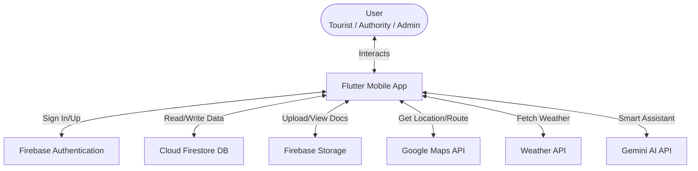

# Smart Tourist Safety App

A comprehensive Flutter-based mobile application designed to enhance tourist safety and experience. The app connects Tourists, Authorities, and Administrators in a unified ecosystem, providing real-time safety features, digital identity management, and smart assistance.

## 🚀 Key Features

### 🌍 For Tourists

- **Digital Identity**: Securely store and display travel documents (Aadhaar, Passport) and generate a **Digital ID**.
- **Live Safety**: Share **Live Location** with authorities or emergency contacts.
- **SOS / Emergency**: Quick access to **Emergency Contacts** and SOS features.
- **Smart Assistant**: AI-powered chat assistant for travel queries and safety tips.
- **Tools**:
  - **QR Scanner**: For quick verification or information access.
  - **Weather Info**: Real-time weather updates for your destination.
  - **Itinerary Manager**: Plan and track your trip schedule.
- **Communication**: Chat system and Feedback submission.

### 👮 For Authorities

- **Authority Dashboard**: Monitor tourist activities and safety status.
- **Tourist Verification**: access tourist details and verify documents via QR or manual search.
- **Incident Management**: Receive and respond to alerts or feedback.

### ⚡ Super Admin

- **User Management**: Full control to **View** and **Delete** Tourist and Authority accounts.
- **Legacy Data Support**: Visual indicators for legacy users (migrated data without roles).
- **System Monitoring**: Overview of system usage and user statistics.

---

## 🛠️ Technology Stack

- **Framework**: [Flutter](https://flutter.dev/) (Dart)
- **Backend**: [Firebase](https://firebase.google.com/)
  - **Authentication**: Email/Password, Phone (OTP), Role-based Access Control (RBAC).
  - **Firestore Database**: Real-time NoSQL DB for storing user profiles, location data, and messages.
  - **Storage**: Securely storing document uploads and profile pictures.
  - **App Check**: Security enforcement to ensure requests come from the genuine app.
- **Maps**: `google_maps_flutter` for location tracking.
- **AI Integration**: Gemini API (for Smart Assistant).

---

## 🔐 Security & Permissions

- **Role-Based Access**: strict Firestore security rules ensure Users can only access their own data, while Authorities have broader read access.
- **Firebase App Check**: Protects API resources from abuse by verifying the authenticity of the client device.
- **Privacy**: Dedicated Verify/Terms/Privacy capabilities built-in.

---

## 📱 Installation & Setup

### Prerequisites

- Flutter SDK (3.0.0 or higher)
- Android Studio / VS Code
- Firebase Project configured.

### 1. Clone the Repository

```bash
git clone https://github.com/your-repo/smart-tourist-app.git
cd smart-tourist-app
```

### 2. Install Dependencies

```bash
flutter pub get
```

### 3. Firebase Configuration

This project relies on `firebase_options.dart`. If setting up a new environment:

1. Install FlutterFire CLI.
2. Run `flutterfire configure` and select your Firebase project.
3. **Important**: Enable **App Check** in your Firebase Console and register your **Debug Token** (printed in console logs during debug run) to avoid "Permission Denied" errors.

### 4. Run the App

```bash
flutter run
```

---

---

## 🔄 Data Flow



---

## 📂 Project Structure

```text
lib/
├── screens/                 # UI Screens for all roles
│   ├── home_screen.dart     # Tourist Home
│   ├── authority_dashboard_screen.dart
│   ├── super_admin_dashboard_screen.dart
│   ├── smart_assistant_screen.dart
│   └── ... (30+ screens)
├── services/                # Business Logic (Weather, Theme, etc.)
├── main.dart                # Entry point & App Check Logic
└── firebase_options.dart    # Firebase Config
```

---

## 🛡️ Admin Credentials (Dev)

*For development/testing purposes only:*

- **Super Admin Email**: `admin@gmail.com`
- **Password**: `admin123`

---

## 🤝 Contribution

1. Fork the Project.
2. Create your Feature Branch (`git checkout -b feature/AmazingFeature`).
3. Commit your Changes (`git commit -m 'Add some AmazingFeature'`).
4. Push to the Branch (`git push origin feature/AmazingFeature`).
5. Open a Pull Request.
